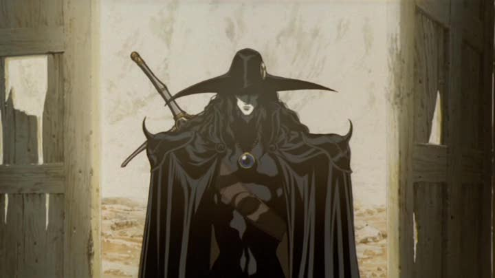

  

---

### 🤔 Em Progresso

Aprendendo os fundamentos do desenvolvimento de jogos com a **Godot Engine**, enquanto também busca evoluir nas áreas de desenvolvimento web e programação.

- 🎮 Aprendendo desenvolvimento de jogos com **Godot Engine**
- 🌐 Estudando desenvolvimento web (HTML, CSS, JavaScript)
- 🐍 Praticando lógica e algoritmos com **Python** e **C/C++**
- 🌱 Sempre aprendendo e construindo novos projetos

---

### 🛠️ Tecnologias & Ferramentas

**Game Dev**

**Web & Programação**

**Ferramentas**

---

### 📊 Top Langs

---

### 📈 Profile Stats

---

  

