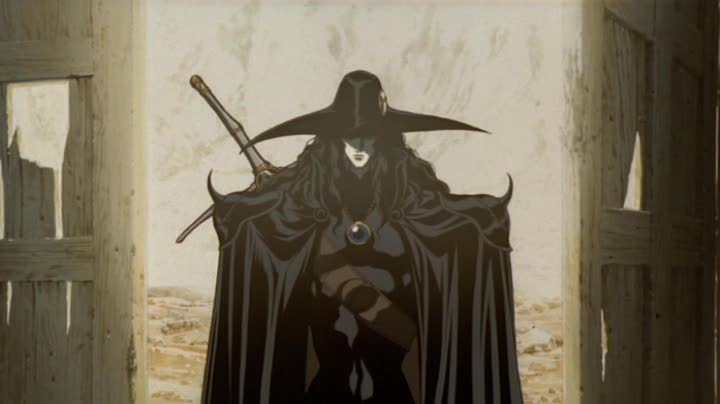

  

---

### 🤔 In Progress

Learning game development fundamentals with **Godot Engine**, while also looking to grow in web development and programming.

- 🎮 Learning game development with **Godot Engine**
- 🌐 Studying web development (HTML, CSS, JavaScript)
- 🐍 Practicing logic and algorithms with **Python**, **C/C++**, and **C#**
- 🌱 Always learning and trying to building new projects

---

### 🛠️ Technologies and Tools

**Game Dev**

**Web & Programming**

**Tools**

---

### 📊 Top Langs

---

### 📈 Profile Stats

---

  

